 

<samp>

[trustlayer](https://github.com/Maxikozie/good-will-prompting) — tells AI assistants which document to trust 
[safelink-guard](https://github.com/Maxikozie/FMHY-SafeLink-Guard) — flags scam links inline, now part of FMHY 
[shira-ui](https://github.com/Maxikozie/shira-ui) — a desktop app for a CLI music downloader 
[cover-posterizer](https://github.com/Maxikozie/cover-posterizer) — a folder of comics, turned into one poster

</samp>

 

<samp>[linkedin](https://www.linkedin.com/in/maximilian-schutte) · [kaggle](https://www.kaggle.com/maximilianschutte)</samp>
